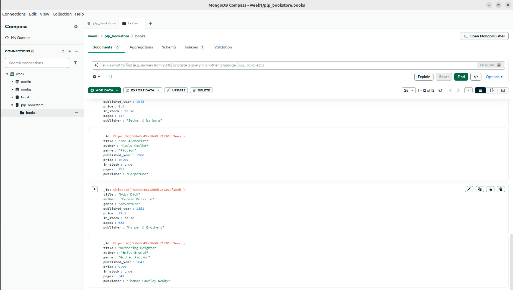

# MongoDB Fundamentals - Week 1

# Setup, Connections & Populating the DB
after downloading compass and installing the community server:
- started using "systemctl start mongod" command followed by "mongosh"
- created cluster named "week1" in compass, then created database and collection named: "plp_bookstore" & "books" respectively.
-node. js was already installed so "npm init -y" & "npm install mongodb" commands were used inside the folder to initialize a package.json file and install MongoDB node js driver.
-confirmed connection in Compass and populated the database using "node insert.js" command.

# all queries in "queries.js" are to be executed using the Mongoshell